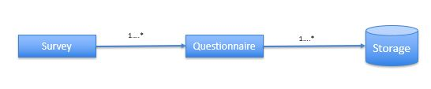
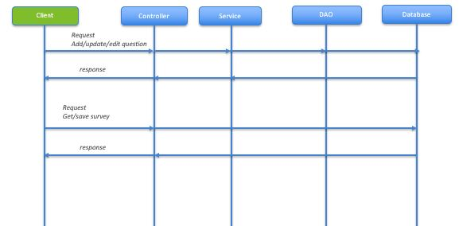

# Market Logic Software Challenge

Problem statement

Design the back-end of an application for a survey application (but just for simple polls comprising a question with multiple choice answer), preferably following the Microservices architecture pattern. Keep in mind the following features:

● Add/edit/delete questions, answers

● Read a list of all questions

● Read a question with all answers

● Respond to a survey

● Read the result for a particular question showing the total number of responses and distribution among the possible answers in percent.

Following are the basic requirements to run the application:
1. Maven
2. JDK 1.8

Following are the steps to execute the project.

1. Download or clone the repo
2. Go the project folder and click on run-application.bat 
3. Observe the spring boot application boots up rest api end-points
4. Once the application is up and running, one can see the rest-api documentation here http://localhost:8080/swagger-ui.html
5. One can also use the existing json collection present in the repo.

Here is the sequence diagram for current rest-api flow:

Future enhancements which can be done:
1. Relation between questionnaire with that of survey (As shown in figure a)
2. Add UI to interact with rest-api
3. Add data base access layer
4. Add database support to persist the data (As shown in figure b)

 
[Figure a]

[Figure b]